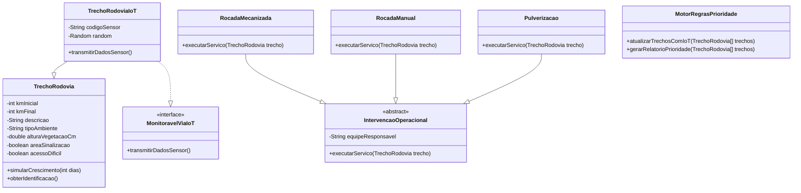

# 🌿 Sprint 2 - Sistema de Monitoramento e Priorização de Roçada em Rodovias

## 🚧 Challenge Sprint 2 - Programação Orientada a Objetos

Projeto desenvolvido em **Java** para a disciplina de **Programação Orientada a Objetos**, com o objetivo de construir um sistema capaz de monitorar trechos de rodovia, analisar o crescimento da vegetação e gerar automaticamente um **relatório de prioridade de roçada**.

O sistema simula diferentes comportamentos de crescimento da vegetação, utiliza sensores IoT, aplica regras de decisão e recomenda o tipo de intervenção operacional mais adequado para cada trecho.

---

## 📌 Objetivo do Projeto

O objetivo principal da Sprint 2 é desenvolver um **motor de regras** para auxiliar na priorização de serviços de roçada em rodovias.

O sistema analisa um conjunto de trechos e identifica automaticamente:

* quais KMs precisam de intervenção;
* qual é o nível de prioridade;
* qual tipo de serviço deve ser executado;
* se o trecho pode ser atualizado automaticamente por sensor IoT.

---

## 🧠 Tema da Sprint

### Motor de Regras para Monitoramento de Vegetação

A proposta considera que diferentes trechos de rodovia podem ter comportamentos distintos:

* Trechos úmidos possuem crescimento mais rápido da vegetação.
* Trechos secos possuem crescimento mais lento.
* Trechos com IoT podem transmitir dados automaticamente.
* Trechos com sinalização ou acesso difícil podem exigir roçada manual.
* Trechos com bom acesso podem receber roçada mecanizada.

---

## 🛠️ Tecnologias Utilizadas

* Java
* Eclipse IDE
* Programação Orientada a Objetos
* Console Java
* `java.util.Random` para simulação de dados IoT

---

## 📁 Estrutura do Projeto

```text
Sprint2_Rodovias_POO/
└── src/
    └── sprint2/
        ├── TrechoRodovia.java
        ├── TrechoRodoviaIoT.java
        ├── MonitoravelViaIoT.java
        ├── IntervencaoOperacional.java
        ├── RocadaMecanizada.java
        ├── RocadaManual.java
        ├── Pulverizacao.java
        ├── MotorRegrasPrioridade.java
        ├── MockSensorIoT.java
        ├── TesteManualIoT.java
        └── SistemaPrincipal.java
```

---

## 🧩 Diagrama Simplificado das Classes



---

## 🧱 Conceitos de POO Aplicados

### 1. Classe Abstrata

A classe `IntervencaoOperacional` foi criada como uma classe abstrata para representar o conceito genérico de uma intervenção na rodovia.

Ela possui o método abstrato:

```java
public abstract String executarServico(TrechoRodovia trecho);
```

Esse método obriga as classes filhas a implementarem seu próprio comportamento.

Classes filhas:

* `RocadaMecanizada`
* `RocadaManual`
* `Pulverizacao`

---

### 2. Interface

A interface `MonitoravelViaIoT` representa um contrato para trechos que possuem tecnologia de monitoramento instalada.

```java
public interface MonitoravelViaIoT {
    double transmitirDadosSensor();
}
```

A classe `TrechoRodoviaIoT` implementa essa interface, permitindo que o sistema atualize automaticamente a altura da vegetação sem inspeção visual.

---

### 3. Herança

O projeto utiliza herança em dois pontos principais.

A classe `TrechoRodoviaIoT` herda de `TrechoRodovia`:

```java
public class TrechoRodoviaIoT extends TrechoRodovia implements MonitoravelViaIoT
```

As classes de intervenção herdam da classe abstrata `IntervencaoOperacional`:

```java
public class RocadaMecanizada extends IntervencaoOperacional
```

---

### 4. Polimorfismo

O polimorfismo aparece quando diferentes tipos de intervenção são tratados pelo tipo genérico `IntervencaoOperacional`.

```java
private IntervencaoOperacional rocadaMecanizada;
private IntervencaoOperacional rocadaManual;
private IntervencaoOperacional pulverizacao;
```

Isso permite que o motor de regras escolha diferentes ações sem depender diretamente de uma única classe concreta.

---

### 5. Encapsulamento

A classe `TrechoRodovia` utiliza atributos privados e métodos públicos de acesso, garantindo maior controle sobre os dados.

Exemplo:

```java
private double alturaVegetacaoCm;
```

A alteração da altura é feita por meio de setter com validação, impedindo valores negativos.

---

## 🌱 Regras de Crescimento da Vegetação

O sistema simula o crescimento da vegetação de acordo com o tipo de ambiente.

```text
Trecho úmido -> crescimento de 1,8 cm por dia
Trecho seco  -> crescimento de 0,8 cm por dia
```

Exemplo no código:

```java
if (tipoAmbiente.equalsIgnoreCase("UMIDO")) {
    crescimentoPorDia = 1.8;
} else {
    crescimentoPorDia = 0.8;
}
```

---

## ⚙️ Motor de Regras

A classe `MotorRegrasPrioridade` é responsável por analisar os trechos e gerar o relatório automático.

Ela verifica:

* altura da vegetação;
* tipo de ambiente;
* se o trecho possui acesso difícil;
* se existe área de sinalização;
* se o trecho possui IoT.

---

## 🚦 Critérios de Prioridade

| Altura da Vegetação | Prioridade |
| ------------------- | ---------- |
| Abaixo de 45 cm     | Baixa      |
| A partir de 45 cm   | Média      |
| A partir de 70 cm   | Alta       |
| A partir de 90 cm   | Crítica    |

---

## 🧰 Tipos de Intervenção

| Condição do Trecho                               | Ação Recomendada        |
| ------------------------------------------------ | ----------------------- |
| Vegetação alta e bom acesso                      | Roçada mecanizada       |
| Vegetação alta com sinalização ou acesso difícil | Roçada manual           |
| Trecho úmido com vegetação intermediária         | Pulverização preventiva |
| Vegetação baixa                                  | Apenas monitoramento    |

---

## 📡 Monitoramento via IoT

Alguns trechos podem possuir sensores IoT instalados.

Esses sensores simulam a transmissão automática da altura da vegetação, sem necessidade de inspeção visual.

Classe responsável:

```java
TrechoRodoviaIoT
```

Interface utilizada:

```java
MonitoravelViaIoT
```

Exemplo de saída:

```text
--- ATUALIZAÇÃO AUTOMÁTICA VIA IoT ---
KM 16 ao KM 17 - Trecho com sensor IoT instalado | Leitura IoT: 82,16 cm
```

---

## 🧪 Mock de Sensor IoT

Para simular um teste simples da interface `MonitoravelViaIoT`, foi criada a classe `MockSensorIoT`.

Ela permite testar a captura de dados sem depender de um sensor real.

Classe de teste:

```java
TesteManualIoT
```

Exemplo de saída:

```text
Leitura capturada pelo mock IoT: 82.5 cm
```

---

## ▶️ Como Executar o Projeto no Eclipse

1. Abra o Eclipse IDE.
2. Clique em `File`.
3. Clique em `Import`.
4. Selecione `Existing Projects into Workspace`.
5. Escolha a pasta do projeto `Sprint2_Rodovias_POO`.
6. Clique em `Finish`.
7. Abra o arquivo:

```text
src > sprint2 > SistemaPrincipal.java
```

8. Clique com o botão direito no arquivo.
9. Selecione:

```text
Run As > Java Application
```

---

## 🧪 Como Testar o Sistema

### Executar o relatório principal

Rode a classe:

```text
SistemaPrincipal.java
```

O sistema irá:

* criar um array de trechos;
* simular crescimento por 7 dias;
* atualizar trechos com IoT;
* gerar o relatório de prioridade.

---

### Testar o mock IoT

Rode a classe:

```text
TesteManualIoT.java
```

Saída esperada:

```text
Leitura capturada pelo mock IoT: 82.5 cm
```

---

## 🧾 Exemplo de Execução

```text
SISTEMA DE MONITORAMENTO DE VEGETAÇÃO EM RODOVIAS
Simulando crescimento da vegetação por 7 dias...

--- ATUALIZAÇÃO AUTOMÁTICA VIA IoT ---
KM 16 ao KM 17 - Trecho com sensor IoT instalado | Leitura IoT: 82,16 cm

========== RELATÓRIO DE PRIORIDADE DE ROÇADA ==========

Trecho: KM 10 ao KM 11 - Trecho seco com boa visibilidade
Ambiente: SECO
Altura da vegetação: 43,60 cm
Prioridade: BAIXA
Ação recomendada: Monitorar. Não precisa de intervenção imediata.

Trecho: KM 12 ao KM 13 - Trecho úmido próximo a mata
Ambiente: UMIDO
Altura da vegetação: 67,60 cm
Prioridade: MÉDIA
Ação recomendada: Pulverizacao
Pulverização preventiva executada pela Equipe Preventiva C.

Trecho: KM 14 ao KM 15 - Trecho com placa de sinalização
Ambiente: UMIDO
Altura da vegetação: 87,60 cm
Prioridade: ALTA
Ação recomendada: RocadaManual
Roçada manual executada pela Equipe Manual B.

Trecho: KM 18 ao KM 19 - Trecho de acostamento com acesso difícil
Ambiente: SECO
Altura da vegetação: 97,60 cm
Prioridade: CRÍTICA
Ação recomendada: RocadaManual
Roçada manual executada pela Equipe Manual B.
```

---

## 📋 Classes do Projeto

| Classe                   | Responsabilidade                                    |
| ------------------------ | --------------------------------------------------- |
| `TrechoRodovia`          | Representa um trecho comum da rodovia               |
| `TrechoRodoviaIoT`       | Representa um trecho com sensor IoT                 |
| `MonitoravelViaIoT`      | Interface para transmissão de dados por sensor      |
| `IntervencaoOperacional` | Classe abstrata base para intervenções              |
| `RocadaMecanizada`       | Executa serviço de roçada mecanizada                |
| `RocadaManual`           | Executa serviço de roçada manual                    |
| `Pulverizacao`           | Executa pulverização preventiva                     |
| `MotorRegrasPrioridade`  | Analisa os trechos e gera o relatório de prioridade |
| `MockSensorIoT`          | Simula um sensor IoT para teste                     |
| `TesteManualIoT`         | Testa manualmente a interface IoT                   |
| `SistemaPrincipal`       | Classe principal que executa o sistema              |

---


## 💬 Perguntas de Reflexão

### Por que não faz sentido executar apenas uma "Intervenção Operacional" genérica?

Porque uma intervenção operacional é apenas um conceito geral. Na prática, a equipe precisa saber exatamente qual serviço será realizado, como roçada mecanizada, roçada manual ou pulverização. Cada tipo de intervenção possui comportamento e objetivo diferente. Por isso, a classe `IntervencaoOperacional` foi criada como abstrata.

---

### Qual a diferença entre herdar de uma classe abstrata e implementar uma interface?

Herdar de uma classe abstrata significa receber uma estrutura base, com atributos e métodos comuns. Já implementar uma interface significa assumir um contrato de comportamento.

No projeto, `TrechoRodoviaIoT` herda de `TrechoRodovia`, pois continua sendo um trecho de rodovia. Ao mesmo tempo, implementa `MonitoravelViaIoT`, pois também possui a capacidade de transmitir dados por sensor.

---

## 👨‍💻 Autores

Gabriel Ramos Moreira
Vinicius Mello Siqueira
Vitor Chen
Fernando Antonio
Amom Ianaguivara
---
